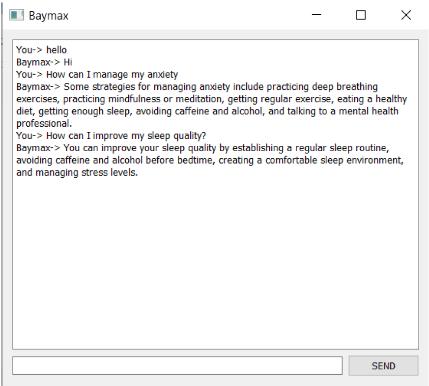
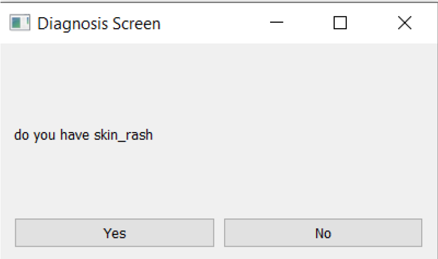
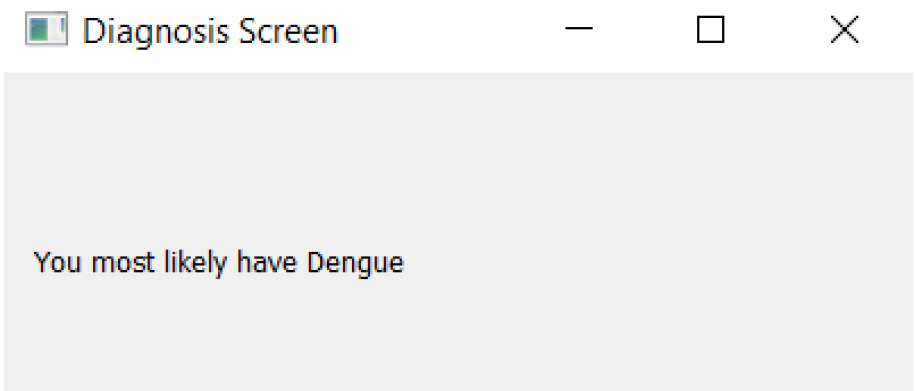

# SymptomSense

## Overview

This project is an intelligent medical assistant that combines a conversational AI (powered by [ChatterBot](https://chatterbot.readthedocs.io/)) with an ensemble machine learning model to interact with users, answer general medical queries, and perform disease classification based on user-reported symptoms. The application features a user-friendly GUI built with PyQt5, providing a seamless chat and self-diagnosis experience.

**Key Features:**
- **Conversational Medical Assistant:** Responds to user queries about health, symptoms, and general medical information using a trained ChatterBot model.
- **Self-Diagnosis Mode:** When the user types "begin", "I am sick", or "self diagnosis", the assistant initiates a guided symptom checker, asking about 37 symptoms.
- **Ensemble Disease Classifier:** Utilizes a voting ensemble of Decision Tree, Naive Bayes, and K-Nearest Neighbors classifiers to predict the most likely disease based on user responses.
- **Interactive GUI:** Built with PyQt5, featuring a chat interface and a step-by-step diagnosis screen.

---

## Table of Contents

- [Demo](#demo)
- [Installation](#installation)
- [Usage](#usage)
- [Project Structure](#project-structure)
- [Data & Training](#data--training)
- [Machine Learning Model](#machine-learning-model)
- [ChatterBot Training](#chatterbot-training)
- [Extending the Project](#extending-the-project)
- [Limitations & Disclaimer](#limitations--disclaimer)
- [License](#license)

---

## Demo

  
  
  
*The assistant answers queries and guides the user through a self-diagnosis session.*

---

## Installation

### Prerequisites

- Python 3.7+

### Required Python Packages

Install the dependencies using pip:

```bash
pip install -r requirements.txt
```

> **Note:**  
> - ChatterBot may require additional setup for language corpora.
> - If you encounter issues with ChatterBot on Python 3.8+, consider using Python 3.7 for compatibility.

---

## Usage

1. **Prepare the Data:**  
   Ensure the following files are present:
   - `data/ml_db.csv` (symptom-disease dataset)
   - `data/cbot_training/` (ChatterBot YAML training files)

2. **Run the Application:**

   ```bash
   cd src
   python app.py
   ```

3. **Interact:**
   - Ask general medical questions in the chat window.
   - Type `begin`, `I am sick`, or `self diagnosis` to start the self-diagnosis process.
   - Answer the symptom questions with "Yes" or "No".
   - Receive a predicted disease at the end of the session.

---

## Project Structure

```
ML_DiseaseClassifier/
│
├── data/
│   ├── ml_db.csv
│   └── cbot_training/
│       ├── conversations.yml
│       ├── greetings.yml
│       └── medical.yml
│
├── src/
│   ├── app.py
│   └── train_eval.ipynb
│
└── README.md
└── requirements.txt
```

- **`src/app.py`**: Main application file (GUI, ChatterBot, ML model).
- **`src/train_eval.ipynb`**: Notebook for data exploration, preprocessing, and model evaluation.
- **`data/ml_db.csv`**: Symptom-disease dataset (37 symptoms, 1 prognosis column).
- **`data/cbot_training/`**: ChatterBot training data (YAML format).

---

## Data & Training

### Dataset

- **Source:** `data/ml_db.csv`
- **Format:** 4920 rows × 38 columns (37 symptoms, 1 disease label)
- **Symptoms:** Binary (Yes/No) for each symptom.
- **Prognosis:** Disease label (41 unique diseases).

### Preprocessing

- Missing values are imputed with the mode.
- Categorical values are label-encoded for ML models.

---

## Machine Learning Model

- **Features:** 37 binary symptom indicators.
- **Target:** Disease label (`prognosis`).
- **Models Used:**
  - Decision Tree Classifier
  - Gaussian Naive Bayes
  - K-Nearest Neighbors
- **Ensemble:** Hard voting classifier combining the above models.
- **Training/Test Split:** 80/20

**Prediction Flow:**
- User answers a series of Yes/No questions about symptoms.
- The binary vector is fed to the ensemble model.
- The predicted disease is displayed to the user.

---

## ChatterBot Training

- **Corpus:** Custom YAML files in `data/cbot_training/`
  - `conversations.yml`: General medical conversations
  - `greetings.yml`: Greetings and small talk
  - `medical.yml`: Medical Q&A
- **Training:** The bot is trained on startup using these files.

---

## Limitations & Disclaimer

- **Not a Substitute for Professional Advice:**  
  This tool is for educational and informational purposes only. It is not a replacement for professional medical diagnosis or treatment.
- **Data Quality:**  
  The accuracy of predictions depends on the quality and coverage of the dataset.
- **ChatterBot Limitations:**  
  The conversational AI is rule-based and may not handle complex or nuanced queries.
